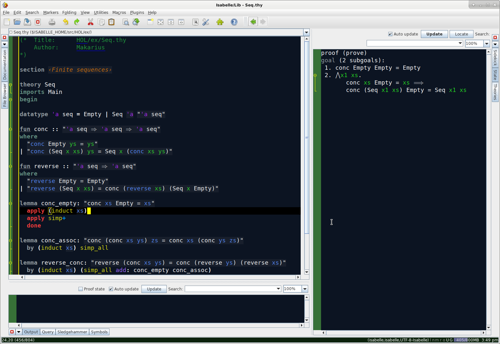

# Scott's personal Isabelle setup instructions
Before the official instructions got cleaned up, this was my own flattened version of the isabelle setup instructions.
Now that they are a lot easier to use, I will refer to the official L4V [setup.md](https://github.com/seL4/l4v/blob/master/docs/setup.md) for the bulk of the setup instructions, with only a few notes remaining here.

## ~/.local/bin (you probably don't need to do this)
We are going to install `repo` to `~/.local/bin`, so first we need to set up that directory and add it to `PATH`.
```
mkdir -p ~/.local/bin
export PATH=$HOME/.local/bin:$PATH
```
We also want this to be added to `PATH` for all future terminal sessions, so add `export PATH=$HOME/.local/bin:$PATH` to `~/.bashrc` (a file which you may have to create).

### Install `repo`
In the past I had some issues with the `apt` version of repo. If that's the case, you can install it manually as below.
```
sudo apt install curl
curl https://storage.googleapis.com/git-repo-downloads/repo > ~/.local/bin/repo  
chmod a+rx ~/.local/bin/repo  
repo
```
If the last command results in `error: repo is not installed. Use "repo init" to install it here` then everything worked as it should.

## Launching
The launch command that I found most useful for my particular work was the following, which I put in an executable `isabelle.sh` in my user directory. This runs everything under the ARM architecture.
```
L4V_ARCH=ARM ~/repos/verification/isabelle/bin/isabelle jedit -d ~/repos/verification/l4v -l Lib&
```

## Make
I use the following command to build images.

The `_QUICK_AND_DIRTY` flags are only needed if you're building (or relying upon) images with sorries in them.

The `-j 7` defines the number of cores to be used for the build (I use one less than my machine's total)

Obviously you want to change `L4V_ARCH` to whatever architecture you're building for.

```
L4V_ARCH=RISCV64 AINVS_QUICK_AND_DIRTY=true ACCESS_QUICK_AND_DIRTY=true INFOFLOW_QUICK_AND_DIRTY=true make InfoFlow -j 7
```

## jEdit colours



I prefer a dark theme for most things, but jEdit+Isabelle doesn't allow this option. I've found some colours I'm happy with, which you can set up if you like. There's no easy import/export for these colours, so you'll need to edit two config files manually. Make these edits while jEdit isn't running, because some settings are saved on close, which will overwrite any changes you made. You'll need to restart Isabelle/jEdit for the changes to take effect anyway.

General jEdit settings are found in the `~/.isabelle/jedit/properties` file. Below are the lines that I add to set up my colours (there might be some unnecessary stuff in here, I'm still working on paring this down).
```
#jEdit colour properties
console.caretColor=\#f8f8f0
jdiff.left-cursor-color=\#000000
jdiff.overview-changed-color=\#ffcc66
jdiff.overview-deleted-color=\#ff6666
jdiff.overview-inserted-color=\#99cc66
jdiff.overview-invalid-color=\#cccccc
jdiff.right-cursor-color=\#000000
log-viewer.message.debug.color=\#cccccc
log-viewer.message.error.color=\#660000
log-viewer.message.message.color=\#99ccff
log-viewer.message.notice.color=\#00cc00
log-viewer.message.warning.color=\#ff6633
tasklist.highlight.color=\#ffffff
vfs.browser.colors.0.color=\#ffa0a0a0
vfs.browser.colors.1.color=\#ff660066
vfs.browser.colors.2.color=\#ff666600
vfs.browser.colors.3.color=\#ff009933
vfs.browser.colors.4.color=\#ff990000
vfs.browser.colors.5.color=\#ff003366
vfs.browser.colors.6.color=\#ff006666
vfs.browser.colors.7.color=\#ff330066
vfs.browser.colors.8.color=\#ff666666
view.bgColor=\#ff0c1422
view.caretColor=\#ffffff00
view.eolMarkerColor=\#ff66ffff
view.fgColor=\#ffffffff
view.gutter.bgColor=\#377137
view.gutter.currentLineColor=\#ff3300
view.gutter.fgColor=\#cccc00
view.gutter.focusBorderColor=\#ffff00
view.gutter.foldColor=\#ffff00
view.gutter.highlightColor=\#ffffff
view.gutter.markerColor=\#669900
view.gutter.noFocusBorderColor=\#acacac
view.gutter.selectionAreaBgColor=\#272822
view.gutter.structureHighlightColor=\#cccccc
view.lineHighlightColor=\#ff000000
view.multipleSelectionColor=\#ff000000
view.pageBreaksColor=\#ff8080ff
view.selectionColor=\#ff660000
view.selectionFgColor=\#ff002b36
view.status.background=\#ff0c220c
view.status.foreground=\#ffffffff
view.status.memory.background=\#f666699a
view.status.memory.foreground=\#ffcccccc
view.structureHighlightColor=\#ffffff00
view.style.comment1=color\:\#ff87ceeb
view.style.comment2=color\:\#ffcd5c5c
view.style.comment3=color\:\#ff999900 style\:i
view.style.comment4=color\:\#ffcc6600
view.style.digit=color\:\#ffcc3300
view.style.foldLine.0=color\:\#ffffffff bgColor\:\#ff452424 style\:b
view.style.foldLine.1=color\:\#ffffffff bgColor\:\#ff625950 style\:b
view.style.foldLine.2=color\:\#ffffffff bgColor\:\#ff3c3c67 style\:b
view.style.foldLine.3=color\:\#ffffffff bgColor\:\#ff314444 style\:b
view.style.function=color\:\#ff98fb98
view.style.invalid=color\:\#ffff0066 bgColor\:\#ffffffcc
view.style.keyword1=color\:\#fff0e68c style\:b
view.style.keyword2=color\:\#ff009966 style\:b
view.style.keyword3=color\:\#ffcc6600 style\:b
view.style.keyword4=color\:\#ff66ccff style\:b
view.style.label=color\:\#ffffdead style\:i
view.style.literal1=color\:\#ffffa0a0
view.style.literal2=color\:\#ffcc6600
view.style.literal3=color\:\#ffffcc00
view.style.literal4=color\:\#ffffffff
view.style.markup=color\:\#ffbdb76b
view.style.operator=color\:\#ff9b9b9b style\:b
view.wrapGuideColor=\#ff8080ff
white-space.block-color=\#006633
white-space.fold-color=\#ffff66
white-space.space-color=\#727b84
white-space.tab-color=\#6c92b8
white-space.whitespace-color=\#ff6600
```

Isabelle-specific settings are found in the file `~/.isabelle/etc/preferences`. Add the following lines to that file. Note that the first two lines below are not colour-related, but are very helpful.
```
jedit_completion_delay = "0"
vampire_noncommercial = "yes"
active_color = "8A8181FF"
active_hover_color = "89BD39FF"
antiquote_color = "25C431FF"
antiquoted_color = "FFC83264"
bad_color = "431818FF"
bound_color = "23D323FF"
canceled_color = "994949FF"
comment1_color = "20933CFF"
comment3_color = "22C437FF"
dynamic_color = "4F982CFF"
error_color = "AB1F1FFF"
error_message_color = "6F272EFF"
free_color = "4B82FDFF"
improper_color = "F53B3BFF"
information_color = "4E788DFF"
information_message_color = "4886AEFF"
inner_numeral_color = "DF0808FF"
keyword1_color = "929BA0FF"
keyword2_color = "649182FF"
legacy_message_color = "716D4BFF"
operator_color = "D7D716FF"
raw_text_color = "1FDE67FF"
running1_color = "990999FF"
running_color = "AC13ACFF"
tooltip_color = "404001FF"
unprocessed1_color = "2F2020FF"
var_color = "B17513FF"
warning_message_color = "774D83FF"
writeln_color = "7D7D7DFF"
writeln_message_color = "404872FF"
```
